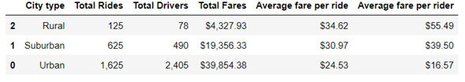

# PyBer_Analysis

## OVERVIEW
### Purpose
The purpose of this analysis is to perform an exploratory analysis on the data provided by the company Pyber. The results of the analysis and the findings about the relationships between the city type, the number of drivers and the fares will help the organization to improve ride sharing services and define the affordability for undeserved neighborhoods.

## RESULTS
From the performed analysis, major differences can be identified between the city type, the number or drivers and the fares amounts. Is clear that the urban cities are the ones with a bigger quantity of total rides, number of riders and fares amounts, and the rural cities, are the ones with the lowest quantity of rides, number of riders and fares amounts. 
This information can be clearly observed in next summary image:

One important thing to emphasize is that the average fare per ride and the average fare per rider are more expensive in the rural cities than in the urban ones. The suburban cities just remain in the middle for all the metrics.
Finally, reviewing the weekly fares for the three types of cities, the fare variation is very different between them, which let us think that the behavior of the clients from one city type cannot be used to extrapolate the possible outcome of another city type. The weekly fares for each city type are shown below:

## SUMMARY
With the information obtained, the company can make some decision about how to improve their services, is clear that the rural cities are the ones with a smaller number of rides and number of drivers, but also is clear that probably because of it, the average fare amount per ride and per drivers are the more expensive ones.  Maybe they should think about increasing the number or rides in the rural cities, in order to satisfy the demand and make less expensive the services. Another option to consider, could be to increase the fare in the urban cities because the larger number of rides and drivers they have.
